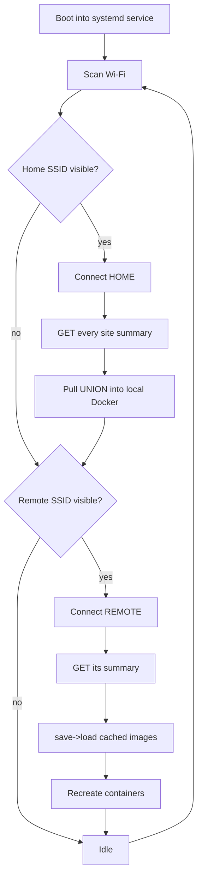

# DockerGo (Raspberry Pi edition)

Sneakernet Docker updater for a **Raspberry Pi 4** with a **GeeekPi 3.5" SPI
touch LCD**. It pre-downloads Docker images on a high-bandwidth *home* network,
is physically carried to low-bandwidth remote sites, then uploads the images to
each site's Docker daemon and recreates the affected containers — all narrated
on the LCD and (optionally) a Discord webhook.

This is a Python port of the original [ESP32-S3 / LILYGO T-Dongle firmware](https://github.com/mayberryjp/dockergo).
Because the Pi runs a **real Docker engine**, the firmware's hand-rolled
Registry-V2 client, content-addressed blob store and OCI archive assembly are
gone — replaced by `docker pull` / `save` / `load` via the Docker SDK.

## How it works



The Pi's **local Docker image store is the cache** — images pulled at home stay
there until applied at a remote site. The Pi never *runs* these images, it only
carries them, so it happily pulls `linux/amd64` images for your Intel sites even
though the Pi itself is arm64.

## Hardware

| Part | Detail |
| --- | --- |
| Board | Raspberry Pi 4B |
| Display | GeeekPi 3.5" SPI resistive TFT (ILI9486 / XPT2046, 480×320) on the 40-pin header |
| OS | Raspberry Pi OS Bookworm, **64-bit Lite** recommended |

The panel appears as a secondary framebuffer (`/dev/fb1`). DockerGo composes each
frame with Pillow and writes raw pixels to it — no desktop, no X/SDL — so it boots
straight into a dedicated status screen.

## Install (on the Pi)

```bash
git clone <this-repo> dockergo && cd dockergo
sudo bash scripts/install.sh
# edit your sites / Wi-Fi:
sudo nano /boot/firmware/dockergo/config.json
sudo reboot
```

The installer adds the panel overlay, applies seamless-boot tweaks, installs the
package globally, writes a config template to the boot partition, and enables a
systemd service that launches the app on every boot. It also enables an updater
that fast-forwards this checkout and reinstalls DockerGo when a new commit is
available. It checks during boot and retries every 15 minutes; update failures
are logged but do not prevent the app from starting. A successful update while
the app is running restarts the service to load the new version.

For an existing installation, pull this update and run `sudo bash scripts/install.sh`
once to install and enable the updater service and timer.

> **Panel driver note:** the installer enables the `mhs35` overlay used by the
> high-speed GeeekPi/Waveshare 3.5". If the screen stays white, install the
> vendor driver (`goodtft/LCD-show` → `MHS35-show`) or switch the overlay to
> `tft35a` for a plain ILI9486. See comments in [scripts/install.sh](scripts/install.sh).

## Update / rebuild (on the Pi)

After the latest source changes have been pushed, update the checkout and
reinstall the package using the same interpreter as the system service. Do not
start the service unless the installed module matches the checkout:

```bash
sudo systemctl stop dockergo
REPO=/home/mayberry/docker-updater-pi
OWNER=$(stat -c '%U' "$REPO")
runuser -u "$OWNER" -- git -C "$REPO" pull --ff-only origin main
git -C "$REPO" log -1 --oneline
sudo /usr/bin/python3 -m pip install --break-system-packages --no-cache-dir --no-deps --force-reinstall "$REPO"
INSTALLED_PACKAGE_DIR=$(cd / && sudo /usr/bin/python3 -c 'import dockergo; from pathlib import Path; print(Path(dockergo.__file__).parent)')
for SOURCE_FILE in "$REPO"/dockergo/*.py "$REPO"/dockergo/display/*.py; do
    RELATIVE_FILE=${SOURCE_FILE#"$REPO"/dockergo/}
    cmp "$SOURCE_FILE" "$INSTALLED_PACKAGE_DIR/$RELATIVE_FILE" || { echo "Installed package mismatch; keeping service stopped"; exit 1; }
done
(cd / && sudo /usr/bin/python3 -c 'import dockergo.__main__; print("DockerGo startup imports OK")') || { echo "Installed package import failed; keeping service stopped"; exit 1; }
sudo systemctl reset-failed dockergo
sudo systemctl start dockergo
sudo journalctl -fu dockergo
```

The byte comparisons prove the modules loaded by `/usr/bin/python3`, which
systemd runs, match the checkout. The entry-point import catches broken or
partial installs before systemd starts the service. `--no-deps` avoids
rebuilding or downloading dependencies. If any check fails, leave DockerGo
stopped and inspect the imported package path with `sudo /usr/bin/python3 -c
'import dockergo; print(dockergo.__file__)'`.

## Configuration

Config is JSON on the boot partition (editable from any PC):
`/boot/firmware/dockergo/config.json`. See [config.example.json](config.example.json).

| Field | Meaning |
| --- | --- |
| `device_name` | Shown on the LCD and used as the Discord username |
| `image_platform` | Manifest-list platform selector (default `linux/amd64`) |
| `discord_webhook` | Optional webhook for mirrored status lines |
| `poll_interval` | Seconds between Wi-Fi scan cycles |
| `sites[]` | `name`, `home` (one or more; first site defaults to home if none are marked), `ssid`, `password`, `docker_api`, `summary_url`, optional `wireguard_connection` on a home site |

For an emergency home hotspot that reaches remotes over WireGuard, set
`"wireguard_connection": "dockergo-emergency"` on that home site. Create a
matching WireGuard connection in NetworkManager and disable its autoconnect.
When that home SSID is visible, DockerGo can use the tunnel to read remote
summaries and download needed images into the Pi's local Docker store. Home
cycles never upload images or update remote daemons, even if a remote Wi-Fi
SSID is also visible. The tunnel stays up while the configured home Wi-Fi is
connected; a NetworkManager dispatcher guard removes it when `wlan0` leaves
that SSID, including if DockerGo stops unexpectedly. Remote `summary_url`
addresses must be routed through the tunnel. Remote daemons are updated only
on remote-only cycles, when no configured home SSID is visible.

Each site exposes a summary endpoint returning the images it still needs:

```json
{ "checks": { "docker_updater": { "pending_images": ["ghcr.io/.../frigate:stable"] } } }
```

Remote daemons only need to expose their API over the network (`docker_api`,
e.g. `tcp://10.0.0.2:2375`). Unlike the firmware, **no containerd/snapshotter
reconfiguration is required** — DockerGo uses the daemon's native `save`/`load`
format, which any Docker engine accepts.

## Running / developing

```bash
# On the Pi, foreground (service must be stopped first):
sudo systemctl stop dockergo
sudo python3 -m dockergo --config /boot/firmware/dockergo/config.json

# One cycle then exit:
sudo python3 -m dockergo --once

# Preview the LCD UI anywhere (writes dockergo-frame.png, no panel needed):
pip install pillow numpy requests docker
python -m dockergo --mock-display --once --config config.json
```

Useful flags: `--fb /dev/fb0`, `--interval 30`, `--mock-display`.

## Project layout

| Module | Responsibility |
| --- | --- |
| [dockergo/config.py](dockergo/config.py) | Load/validate `config.json` |
| [dockergo/status.py](dockergo/status.py) | Thread-safe status shared with the display |
| [dockergo/display/framebuffer.py](dockergo/display/framebuffer.py) | Pillow → `/dev/fb1` writer (PNG fallback off-device) |
| [dockergo/display/ui.py](dockergo/display/ui.py) | Status screen layout |
| [dockergo/wifi.py](dockergo/wifi.py) | nmcli scan / prioritized connect |
| [dockergo/summary.py](dockergo/summary.py) | Fetch `pending_images` |
| [dockergo/docker_ops.py](dockergo/docker_ops.py) | pull / transfer / recreate via the Docker SDK |
| [dockergo/discord.py](dockergo/discord.py) | Batched webhook mirror |
| [dockergo/orchestrator.py](dockergo/orchestrator.py) | Home-first state machine |
| [dockergo/__main__.py](dockergo/__main__.py) | Display thread + loop wiring |
